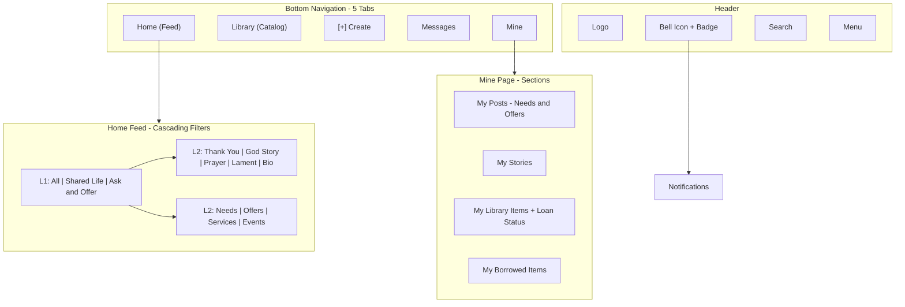

# FIMBY Navigation & Feed Restructure

## Current State

- **Bottom nav** (`fimbyBottomNavigation`): 6 tabs -- Home, Shared Life, Ask & Offer, Library, Messages, Me
- **Header** (`fimbyUniversalHeader`): Same 6 desktop nav tabs + [+], Search, Menu buttons + menu overlay
- **3 separate feed components**: `fimbyHomeFeed` (unified), `fimbyStoriesFeed` (stories-only), `fimbyAskOfferFeed` (ask/offer only, mock data)
- **Library** (`fimbyLibraryBrowser`): Standalone catalog
- **Notifications** (`fimbyNotificationsList`): Accessible via menu, uses mock data
- **Profile** (`fimbyUserProfileView`): Tabs for Posts/Stories/Library, uses mock data

## Target State

---

## Phase 1: Bottom Nav Restructure

**Files to modify:**

- [fimbyBottomNavigation.html](FIMBY/force-app/main/default/lwc/fimbyBottomNavigation/fimbyBottomNavigation.html)
- [fimbyBottomNavigation.js](FIMBY/force-app/main/default/lwc/fimbyBottomNavigation/fimbyBottomNavigation.js)
- [fimbyBottomNavigation.css](FIMBY/force-app/main/default/lwc/fimbyBottomNavigation/fimbyBottomNavigation.css)

**Changes:**

- Remove `stories` and `askOffer` tabs, rename `profile` to `mine`
- Add center `create` tab with [+] button styling (distinct from other tabs).  Repurpose the + from the fimbyUniversalHeader
- Update `TAB_ROUTES` mapping:
  - `home`: `/` (unchanged)
  - `library`: `/library-list`, `/library-item`, `/borrow-item`, etc. (unchanged)
  - `create`: triggers quick-post modal (no navigation, fires event)
  - `messages`: `/messages`, `/conversation`, etc. (unchanged)
  - `mine`: `/mine`, `/my-items`, `/responses`, `/loaned-items`
- Update `TAB_ICONS` to use 5 icons (need a new "Mine" icon, and a [+] icon)
- Update `navigateToPage()` -- `create` tab opens modal instead of navigating
- Absorb stories/ask-offer route prefixes into `home` tab so those legacy URLs still highlight Home

---

## Phase 2: Header Restructure

**Files to modify:**

- [fimbyUniversalHeader.html](FIMBY/force-app/main/default/lwc/fimbyUniversalHeader/fimbyUniversalHeader.html)
- [fimbyUniversalHeader.js](FIMBY/force-app/main/default/lwc/fimbyUniversalHeader/fimbyUniversalHeader.js)
- [fimbyUniversalHeader.css](FIMBY/force-app/main/default/lwc/fimbyUniversalHeader/fimbyUniversalHeader.css)

**Changes:**

- **Desktop nav**: Update from 6 tabs to 5 matching the bottom nav (Home, Library, [+], Messages, Mine)
- **Add bell icon** to the action section (next to Search and Menu buttons)
  - Bell icon with notification badge count
  - On click: navigate to `/notifications`
  - Badge count driven by new `@track notificationCount` property
- **Update menu overlay** items:
  - Remove "All Stories", "Needs & Offers" (absorbed into Home feed)
  - Keep "Community Library" (separate nav)
  - Move "My Responses" and "My Borrowed Items" under Mine
  - Simplify menu to: Browse (Library), Account (Profile, Settings, Help, Logout)
- **Update TAB_ROUTES and TAB_ICONS** to match Phase 1 changes

---

## Phase 3: Home Feed - Cascading Filters

**Files to modify:**

- [fimbyHomeFeed.html](FIMBY/force-app/main/default/lwc/fimbyHomeFeed/fimbyHomeFeed.html)
- [fimbyHomeFeed.js](FIMBY/force-app/main/default/lwc/fimbyHomeFeed/fimbyHomeFeed.js)
- [fimbyHomeFeed.css](FIMBY/force-app/main/default/lwc/fimbyHomeFeed/fimbyHomeFeed.css)
- [FimbyHomeController.cls](FIMBY/force-app/main/default/classes/FimbyHomeController.cls)

### HTML Changes

- **Level 1 filter pills**: All | Shared Life | Ask & Offer (remove Library pill)
- **Level 2 filter row** (conditionally rendered below L1):
  - When "Shared Life" selected: All | Thank You | God Story | Prayer | Lament | Bio
  - When "Ask & Offer" selected: All | Needs | Offers | Services | Events
  - When "All" selected: no L2 row shown
- **Library "just listed" card template**: New lightweight card variant for Option B -- a compact announcement card ("New item to borrow: Sarah added a **Drill** to the library") that only appears in the "All" feed for items created within last 7 days

### JS Changes

- Add `@track activeSubFilter = 'All'` for L2 state
- Add sub-filter handler methods mirroring the patterns from `fimbyStoriesFeed` (Thank You, God Story, etc.) and `fimbyAskOfferFeed` (Needs, Offers, etc.)
- Intro pill colors for: Needs, Offers, Events
- Update `applyFilter()` to handle two-level filtering:
  - L1 filter sets `feedType` ('all', 'story', 'askOffer')
  - L2 filter sets `subType` (e.g., 'Thank You', 'Need', 'Offer')
- Port story type badge/accent logic from `fimbyStoriesFeed.js` (BADGE_CLASS_MAP, ACCENT_COLORS) into home feed
- For library items in "All" view: filter to only show items created in last 7 days, render with lightweight card template

### Apex Changes (`FimbyHomeController.getUnifiedFeed`)

- Add optional `category` and `subType` parameters
- When `category = 'story'` and `subType` provided: add `AND Type__c = :subType` to story query
- When `category = 'askOffer'` and `subType` provided:
  - 'Need'/'Offer': filter by `RecordType.Name`
  - 'Services': filter by `Type__c LIKE '%Services%'`
  - 'Events': filter by `Type__c = 'Event'`
- When category is 'all' or null: library items limited to `CreatedDate = LAST_N_DAYS:7` for Option B "just listed" behaviour
- When category is 'story' or 'askOffer': exclude library items entirely from the query

---

## Phase 4: "My Stuff" Page (New Component)

**New files to create:**

- `fimbyMyStuffPage/fimbyMyStuffPage.html`
- `fimbyMyStuffPage/fimbyMyStuff.js`
- `fimbyMyStuffPage/fimbyMyStuff.css`
- `fimbyMyStuffPage/fimbyMyStuff.js-meta.xml`
- `FimbyMyStuffController.cls` (Apex)
- `FimbyMyStuffControllerTest.cls` (Apex test)

### Component Design

- Similar feed design to the homepage but with 4 filter chips:
  - **My Posts** (Needs & Offers): type pill, status badges
  (Active/Replied/Completed), response count, tap to manage (defaulted pill selection)
  - **My Stories**: type pill, comment counts
  - **My Library Items**: type pill, availability status, who has it, due date, total count of items
  - **My Borrowed Items**: item name, owner, due date, return/extend actions, total count of items
- Each item should be a condense rectanle card with no image displayed
- items sorted by:
  - posts newest to oldest ("Post Archive" link a bottom of list - navigates to all post for all time - on its own page, display with pagination 20 items per page).
  - stories newest to oldest - show 10 most recent ("Story Archive" link a bottom of list - navigates to all stories for all time - on its own page, display with pagination 20 items per page)
  - Library Item newest listed to oldest - show all items actively borrowed from me first no limit OR the first 10 items available to borrow ("Manage All items" link a bottom of list - navigates to all of my items - on its own page if all items are not already in view, display with pagination 20 items per page)
  - My borrowed items- due date furtherest into the pass to due furthest in the future - show all borrowed items no limit  (no extra page to navigate to)
- Profile info card at top "**My Details**" (avatar, name, neighbourhood) with "Edit Profile" and "Settings" links (replaces old Profile tab)

### Apex Controller (`FimbyMineController`)

- `getMyPosts()` -- `Needs_Offers__c WHERE Posted_By__c = :currentContactId`
- `getMyStories()` -- `Story__c WHERE Posted_By__c = :currentContactId`
- `getMyLibraryItems()` -- `Library_Item__c WHERE Owner_Contact__c = :currentContactId`
- `getMyBorrowedItems()` -- `Loaned_Item__c WHERE Loaned_To__c = :currentContactId`
- `getMyLentItems()` -- `Loaned_Item__c WHERE Owned_By__c = :currentContactId`
- `getMineSummary()` -- aggregate counts for all sections in one call (performance)

### Experience Site Route

- New route: `/mine` mapped to a view containing `c:fimbyMinePage`
- Update existing routes to redirect `/profile` to `/mine` (or keep `/profile` as a sub-view within Mine)

---

## Phase 5: Notifications Bell in Header

**Files to modify:**

- [fimbyUniversalHeader.html](FIMBY/force-app/main/default/lwc/fimbyUniversalHeader/fimbyUniversalHeader.html) (add bell icon)
- [fimbyUniversalHeader.js](FIMBY/force-app/main/default/lwc/fimbyUniversalHeader/fimbyUniversalHeader.js) (add notification count logic)
- [fimbyUniversalHeader.css](FIMBY/force-app/main/default/lwc/fimbyUniversalHeader/fimbyUniversalHeader.css) (bell icon styling)

**Changes:**

- Add bell icon button in `action-section`, positioned before Search button
- Bell shows red badge with count when `notificationCount > 0`
- On click: `location.href = '/notifications'` (reuses existing `fimbyNotificationsList` page)
- Notification count: new Apex method `getUnreadNotificationCount()` called on `connectedCallback` and periodically refreshed

---

## Phase 6: Deprecation & Cleanup

**Components to retire (after migration is stable):**

- `fimbyStoriesFeed` -- all functionality absorbed into `fimbyHomeFeed` cascading filters
- `fimbyAskOfferFeed` -- all functionality absorbed into `fimbyHomeFeed` cascading filters (this used mock data anyway)

**Routes to update:**

- `/shared-life-list` -- redirect to `/` with `?filter=story` query param, or remove route
- `/ask-offer-list` -- redirect to `/` with `?filter=askOffer` query param, or remove route
- `/profile` -- redirect to `/mine` or keep as alias

**Menu overlay cleanup:**

- Remove "All Stories" and "Needs & Offers" browse items
- Update "My Responses" and "My Borrowed Items" to navigate to `/mine`

---

## Icon Requirements

New icons needed in the `Impact_Icons` static resource:

- **Mine tab icon** (ProfileActive + ProfileInactive variants) -- reuse existing Profile icons
- **[+] Create icon** --  (can use `Impact_Icons add.png`)
- **Bell icon** -- for notifications in header (can use `Impact_Icons BellActive.png BellInactive/png`)
maybe we can learn from this: [https://github.com/salesforce-experiencecloud/notificationbell](https://github.com/salesforce-experiencecloud/notificationbell)

## Implementation Order

Phases 1-2 (nav restructure) should ship together since they share TAB_ROUTES logic. Phase 3 (cascading filters) can follow immediately. Phase 4 (Mine page) and Phase 5 (bell icon) can be built in parallel. Phase 6 (cleanup) happens last once everything is stable.