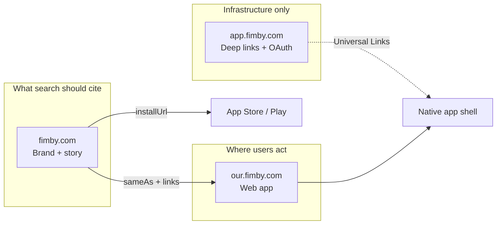

# Three-domain strategy — FIMBY web presence

Canonical source: [`canonical.json`](canonical.json)

## Domain roles

| Domain | Role | Indexing posture |
|--------|------|------------------|
| **fimby.com** | Canonical **entity home** — marketing, FAQ, legal, story | **Index** all public pages; JSON-LD + AIOSEO anchor here |
| **our.fimby.com** | **Product** — Experience Cloud LWR (login, sign-up, app UI) | Public entry pages indexable with brand pointer; authenticated app pages naturally low-value for search |
| **app.fimby.com** | **Deep links + OAuth** — not for human browsing | **Do not promote** in marketing, sitemaps, or schema as a destination |

## fimby.com (marketing)

- All `Organization`, `MobileApplication`, `WebApplication`, `FAQPage` schema `@id` values use `fimby.com` URLs.  
- AIOSEO Knowledge Graph = `https://fimby.com/#organization`.  
- Store badges, FAQ, and footer repeat the bridge sentence: web + app = same product.

## our.fimby.com (Experience Cloud)

Experience Builder SEO controls are limited. Manual steps for public pages:

### Login page (`/login`)

| Setting | Suggested value |
|---------|-----------------|
| Page title | `Sign in — FIMBY` |
| Meta description | `Sign in to FIMBY at our.fimby.com. Neighbourhood mutual aid — ask, offer, lend, and gather with the people near you. New here? Visit fimby.com to learn more.` |
| Canonical | Prefer pointing to `https://fimby.com/` for “what is FIMBY” queries; login page can self-canonical |

### Sign-up page (`/sign-up`)

| Setting | Suggested value |
|---------|-----------------|
| Page title | `Join FIMBY — check your neighbourhood` |
| Meta description | `Enter your postal code to join FIMBY or join the waitlist. Free neighbourhood platform for asks, offers, lending, and gatherings. Also on iPhone and Android.` |

### Authenticated pages (home feed, messages, etc.)

- Behind login → crawlers cannot index content (expected).  
- Do **not** attempt to SEO individual post URLs on `our.fimby.com`; `fimby.com` owns the brand narrative.

### Footer / login chrome (optional future)

- Add a subtle “Learn about FIMBY” link → `https://fimby.com/` on login/sign-up LWCs if not already present.

## app.fimby.com (applinks)

- Serves `apple-app-site-association` and `assetlinks.json` only (+ OAuth fallback).  
- **Exclude** from `fimby.com` sitemap and `sameAs` as a human destination (included in `sameAs` only as `our.fimby.com` for the web product).  
- Share links in notifications/emails should use paths that resolve through Universal Links when possible (`https://app.fimby.com/...` → native app → Experience Cloud path).

## Redirects (Redirection plugin)

Not required for this plan. Consider only if:

- Legacy slug `/family-in-my-backyard/` still receives traffic → 301 to `/`  
- Duplicate content surfaces on both `www` and apex → pick one canonical host in AIOSEO

## Competing with yourself — avoid

- Do not write unique “About FIMBY” long-form copy on `our.fimby.com` that contradicts `fimby.com`.  
- Do not index `app.fimby.com/oauth/callback`.  
- Do not use different product descriptions in store listings vs website (see [`store-listings.md`](store-listings.md)).
